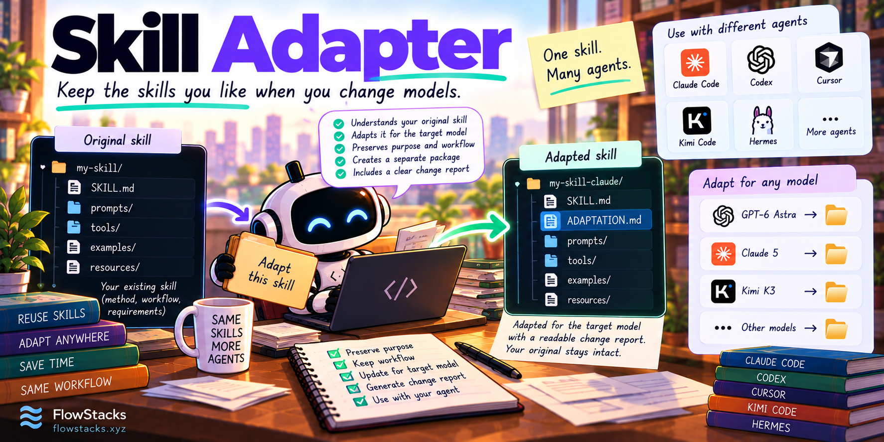

# Skill Adapter

<p>
  <a href="https://github.com/smukh/skill-adapter/tree/main/skills"></a>
  <a href="https://agentskills.io/specification"></a>
  <a href="LICENSE"></a>
  <a href="https://github.com/smukh/skill-adapter/actions/workflows/validate.yml"></a>
  <a href="https://github.com/smukh/skill-adapter/stargazers"></a>
</p>

<p>
  <a href="https://webafterai.substack.com/"></a>
</p>

> Keep the skills you like when you change models.



One Agent Skill that adapts existing skills for a target model while preserving their purpose, workflow, and requirements. The agent you already use does the rewriting—no service or separate API key.

Ask it to adapt a skill, and it produces a separate package with a readable change report. Your original stays intact. If no change is justified, it says so.

## Try it

After installing, ask your agent:

> Use skill-adapter to adapt /path/to/my-skill for GPT-6 Astra. Preserve its method and save the adapted copy under ./adapted-skills.

You can also request your current model, or ask the agent to use the adapted copy afterward:

> Adapt this skill for my current model, then use it for this task. Ask me for the model if you cannot identify it reliably.

## Install

From a local clone, copy the **whole** `skills/skill-adapter/` directory, including references and scripts, into your agent's skill location.

| Agent | Install | Invoke |
|---|---|---|
| Codex | `.agents/skills/skill-adapter/` | `$skill-adapter` |
| Claude Code | `.claude/skills/skill-adapter/` | `/skill-adapter` |
| Cursor | `.cursor/skills/skill-adapter/` | Select it in the skills UI or request it by name |
| Kimi Code CLI | `.kimi/skills/skill-adapter/` on legacy releases; see note below | `/skill:skill-adapter` |
| Hermes | Add this repository's absolute `skills/` path to `skills.external_dirs` | `/skill-adapter` |

For example, install into a Codex project:

```sh
mkdir -p /path/to/project/.agents/skills
cp -R skills/skill-adapter /path/to/project/.agents/skills/
```

Newer Kimi Code releases document `$KIMI_CODE_HOME/skills/`, defaulting to `~/.kimi-code/skills/`. Follow your installed release's documented location. [Compatibility details](COMPATIBILITY.md).

## Model profiles

| Profile | Current evidence |
|---|---|
| GPT-6 Astra | Official model guidance; one adaptation and two paired behavioral probes completed |
| Claude 5 generation | Official generation-level guidance; behavior not tested here |
| Kimi K3 | Conservative preservation and packaging guidance; no K3-specific optimization claim |
| Other explicitly named models | Generic preservation guidance; no model-specific optimization claim |

There is **one installable skill**, with three target profiles and a generic fallback. Profiles are supporting references, not separate skills. [Profile definitions](skills/skill-adapter/references/profiles.md).

## How model identification works

An explicit target takes priority. Otherwise, the adapter uses trusted current-session metadata when the host exposes it. Saved defaults, application names, and writing style are insufficient. If identity is unavailable or ambiguous, it asks once.

Claude Code status-line payloads and Cursor hooks expose model fields. Kimi has session status; Hermes and Codex provide active-model information through their session interfaces. A plain skill cannot automatically access all of these surfaces. [Host-by-host identity guide](skills/skill-adapter/references/model-identity.md).

An optional Python 3.10+ helper resolves a supplied model ID or session payload. It does not collect credentials, scan personal transcripts, install hooks, or change the running model.

## What gets adapted

The adapter can clarify broad triggers, remove duplicate coaching, and make unnecessary preliminary reading conditional on the task. It preserves domain rules, deliberate workflows such as TDD and one-question interviews, output contracts, supporting resources, and approval boundaries.

Each adaptation includes an `ADAPTATION.md` report identifying the source, target, profile, changes, retained requirements, and checks performed. Adapt once and reuse; revisit it when the source, model, or profile changes.

Installation does not automatically rewrite every skill or intercept other invocations. If the original instructions are already loaded, use a fresh task for a clean comparison.

## Evaluation

The initial evaluation ran on **GPT-6 Astra through Codex CLI 0.157.1**: one adaptation call and four fresh comparison calls covering two prompts with the original and adapted skill.

The adaptation preserved source files, resources, invocation controls, and substantive requirements. Both versions retained the clarification gate, test-before-fix procedure, deployment approval boundary, and honest reporting of unexecuted evidence. The observed change was narrower context reading instead of reading every repository file.

These are small preservation tests, not proof of universal performance improvement. Claude and Kimi behavior has not been tested. [Results and actual outputs](evals/RESULTS.md) · [Reproduce the evaluation](evals/README.md).

## Development

```sh
python3 scripts/validate.py
python3 -m unittest discover -s tests -v
```

[Contributing](CONTRIBUTING.md) · [Compatibility](COMPATIBILITY.md) · [MIT license](LICENSE)

## Citation

If you use Skill Adapter in your work, you can cite the repository:

```bibtex
@online{smukh2026skilladapter,
  author = {Mukhopadhyay, Sromana},
  title = {Skill Adapter},
  date = {2026-09-27},
  url = {https://github.com/smukh/skill-adapter},
  langid = {en}
}
```
